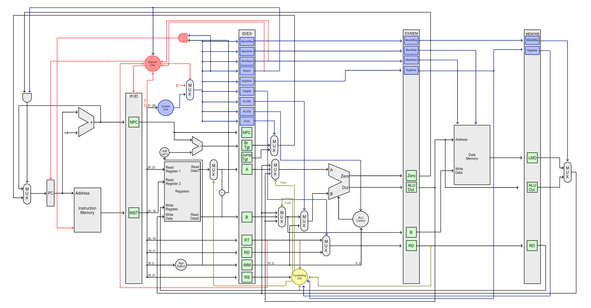

# rusty-mips

A MIPS simulator written in Rust.


## Diagram




## Third-party dependency

This project was bootstrapped by [create-neon](https://www.npmjs.com/package/create-neon).
It implies using Rust for making native Node.js plugin.

This project uses [Electron](https://www.electronjs.org/).

## Available Scripts

In the project directory, you can run:

### `npm install`

Installs the project depdendencies.
Run this before anything else.
You need to re-run this only if dependency changes.

### `npm start`

Starts the Electron app in debug mode.
This builds the Rust module in debug mode, and React also uses debug mode.

### `npm run serve`

Starts the Electron app in release mode.
This builds the Rust module in release mode, while React uses debug mode.

### `npm run dist`

Packages the Electron app for current platform.
Due to complicated nature of building a native library,
it is only possible to build for current platform only.

It *could* be possible to workaround above limitation by using Docker.

This builds the Rust module in release mode.

## License

This program is licensed under "GPLv2+".

```
This program is free software: you can redistribute it and/or modify it under
the terms of the GNU General Public License as published by the Free Software
Foundation, either version 2 of the License, or (at your option) any later
version.
```

You can find the full licence text of GPLv2 in `LICENSE.md`. License text of
later versions can be found on Free Software Foundation website.
